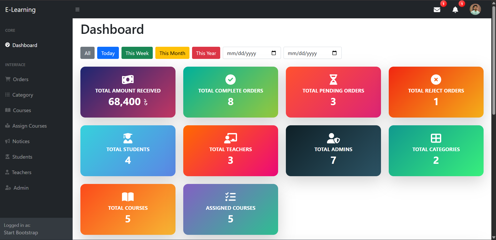
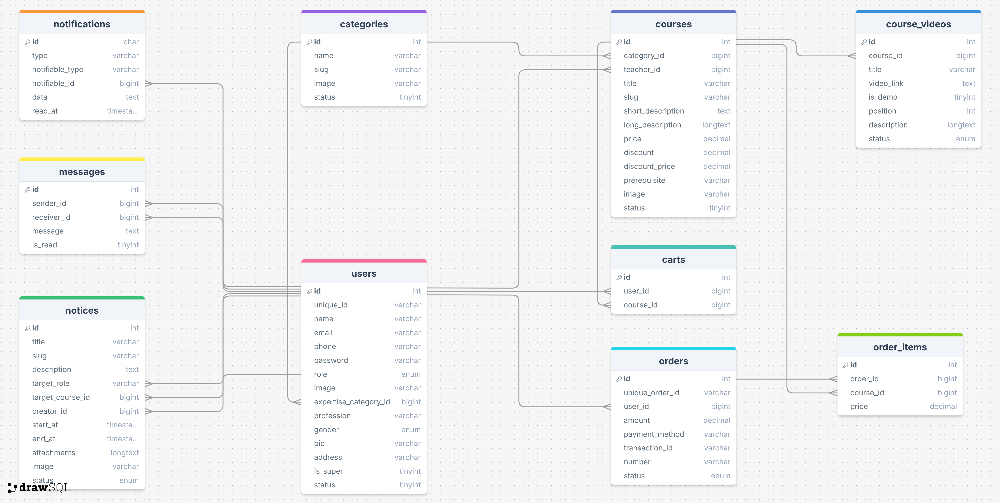

# 🎓 Laravel E-Learning Platform

This project is an **Online Learning Management System (LMS)** built with Laravel-12.  
It allows students to browse and purchase courses, watch video lessons, receive notices, and interact with teachers through messaging and notifications.  
Teachers and admins can create courses, send notices, and manage users efficiently.

---

## 🚀 Features

- 👨‍🎓 **User Management**
  - Supports multiple roles (Student, Teacher, Admin).
  - Manage profile details such as expertise, bio, address, and profession.

- 📚 **Courses & Categories**
  - Organize courses under different categories.
  - Each course includes a short/long description, price, discount, prerequisites, and an image.

- 🎥 **Course Videos**
  - Upload multiple videos per course.
  - Support for demo videos, video ordering (position), and detailed descriptions.

- 🛒 **Cart & Orders**
  - Add courses to cart and place orders.
  - Order tracking with order items, payment method, and transaction ID.
  - Supports discounts and final payable price calculation.

- 📢 **Notices System**
  - Target notices to specific user roles or courses.
  - Each notice includes title, description, attachments, image, and active duration.

- 💬 **Messaging System**
  - Direct messaging between users.
  - Read/unread message status tracking.

- 🔔 **Notifications**
  - Real-time notifications for events like new messages, orders, or notices.

---

## 🗂 Database Schema

Main tables include:

- **users** → Manages user info (roles, expertise, bio, etc.)
- **categories** → Course categories
- **courses** → Course details (price, discount, content)
- **course_videos** → Video lessons for each course
- **carts** → Courses added to user cart
- **orders & order_items** → Purchased courses and transactions
- **notices** → Notices targeted to users or courses
- **messages** → User-to-user direct messaging
- **notifications** → System notifications

---

## 🛠 Tech Stack

- **Backend:** Laravel  
- **Database:** MySQL  
- **ORM:** Eloquent  
- **Authentication:** Laravel Breeze 

---

## 📌 Future Improvements
- Integration with **payment gateways**  
- **Live classes** support  
- **Certificates** for completed courses  
- Advanced **admin dashboard** for analytics  

---

## 📷 Admin Dashboard



---

## 📷 Database Diagram



---

## 🏁 Getting Started

1. Clone the repository:
   ```bash
   git clone https://github.com/NiazAhmedNayeem/e_learning_platform.git
   cd e_learning_platform
